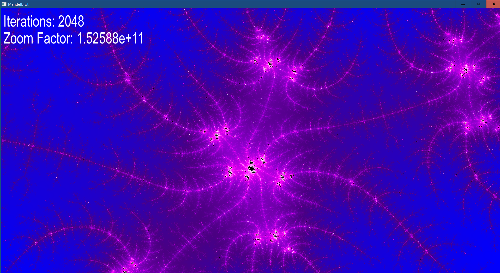

# Mandelbrot

A program made using the SFML library, that renders in real time the Mandelbrot set. Used OpenMP to enable multithreading.
Also used this template to set up the project: https://github.com/ufrshubham/sfml-project-template

## Table of Contents

- [Introduction](#introduction)
- [Features](#features)
- [Getting Started](#getting)
- [Screenshot](#screenshot)

## Introduction

This program uses the SFML library to render the famous Mandelbrot set in real-time. The program allows you to explore the Mandelbrot set by zooming in and out and panning around, while also displaying the current number of iterations and zoom factor.

## Getting started
You will need to install the SFML library, as well as a C++ compiler that supports C++14 or later and it should have support for OpenMP.

## Features

- Real-time rendering of the Mandelbrot set
- Zoom in and out of the set by pressing the left or right mouse button
- Move around the set using the arrow keys
- Display the number of iterations and zoom factor on the screen
- Change the number of iterations using the scroll wheel

## Screenshot

